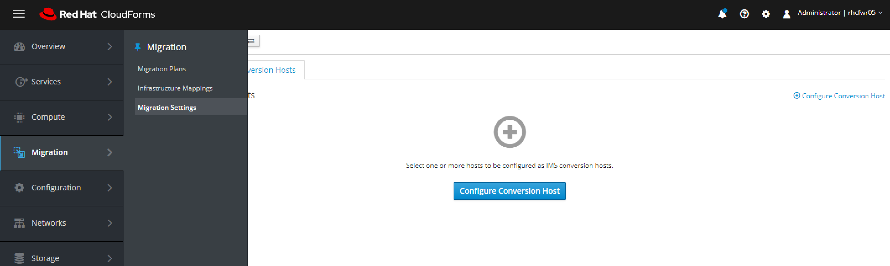
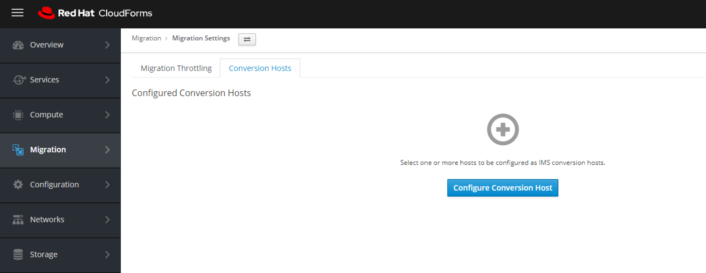

# Proceso de Configuración de IMS v 1.2 para migrar desde VMware 6.0 o superior a RVH 4.3.4 o superior
## Objetivo
El objetivo de este procedimiento es mostrar los pasos para realizar una migración de maquinas virtuales desde VMware a Red Hat Virtualization, usando la solución IMS v1.2.

Fuente oficial en [https://access.redhat.com](https://access.redhat.com/documentation/en-us/red_hat_infrastructure_migration_solution/1.2/html/infrastructure_migration_solution_guide/index)

Iniciamos con la arquitectura propuesta en la que intervienen los siguientes componentes
  - Cloudforms
  - Vsphere
  - RHVM


## Prerequisitos
1. Permisos de Red

La conexión de red enter el ambiente VMware, RHV, Conversion Host y Cloudforms debería ser fiable y estable, a continuación se relacionan las reglas de FW que deben estar activar para garantizar el correcto funcionamiento.


2. Versiones de productos soportados.

Las versiones de software soportadas por IMS en version 1.2 son:


 
3. SO Operativos soportados: El listado de los SO soportados para migración se encuentran [Aquí](https://access.redhat.com/articles/973163)

## Preparacion del ambiente VMware.
Las VMs, deben garantizar los siguientes ajustes:
- Tener instaladas las VMtools.
- NO contar con imágenes ISO montadas, o agregadas.
- Asegurarse que cada interface de red solo cuente con un dirección IPv4 o IPv6.
- El nombre de la VM solo debe contener caracteres (-_. ó A-Za-Z ó 0-9).
- Asegurese que el nombre de la VM no este duplicado sobre el ambiente RHV.

## Preparacion del ambiente RHV.
Sobre el ambiente de Red hat Virtualization, se deben garantizar los siguientes ajustes:
- Definir un Domain Data, con suficiente espacio para la almacenar las VM a migrar.
- Definir un Domain ISO, que contenga las imágenes iso para las RHV-tools y virtIO.
- Cargar las imágenes iso [RHV-Tools y VirtIO](https://access.redhat.com/documentation/en-us/red_hat_virtualization/4.3/html-single/administration_guide/index#Uploading_the_VirtIO_and_Guest_Tool_Image_Files_to_an_ISO_Storage_Domain) al Damain ISO.

Sobre el servidor RHVM instalar los paquetes que proveen los virtIO y las rhv-tools
```
# yum -y install virtio-win rhv-guest-tools-iso*
# engine-iso-uploader --iso-domain=ISODomain upload  \
    /usr/share/virtio-win/virtio-win_amd64.vfd \
    /usr/share/virtio-win/virtio-win_servers_amd64.vfd \
    /usr/share/virtio-win/virtio-win_servers_x86.vfd \
    /usr/share/virtio-win/virtio-win_x86.vfd \
    /usr/share/virtio-win/virtio-win.iso \
    /usr/share/rhv-guest-tools-iso/RHV-toolsSetup_version.iso

```
> **Nota**
>
> El nombre de ISODomain puede cambiar en su ambiente.

- Opcionalmente se puede [crear un MAC Address Pool](https://access.redhat.com/documentation/en-us/red_hat_virtualization/4.3/html/administration_guide/sect-mac_address_pools#Creating_MAC_Address_Pools), con las direcciones MAC de las maquinas a ser migradas.

> **Nota** 
>  
> Si el MAC Address Pool de RHV se solapa con las direcciones de las vm de VMware, se debe asegurar que estas no se dupliquen, si lo hacen fallara la migración.

- Activar los repositorios necesarios sobre rhv-manager y (rhv-host)

**RHV-MANAGER**
```
# subscription-manager repos \
    --disable='*' \
    --enable=rhel-7-server-rpms \
    --enable=rhel-7-server-supplementary-rpms \
    --enable=rhel-7-server-rhv-4.3-manager-rpms \
    --enable=rhel-7-server-rhv-4-manager-tools-rpms \
    --enable=rhel-7-server-ansible-2.9-rpms \
    --enable=jb-eap-7.2-for-rhel-7-server-rpms
```
**RHV-HOSTS**
```
# subscription-manager repos --enable=rhel-7-server-rhvh-4-rpms
```
## Preparación del Ambiente Cloudforms
- Agregar proveedor de infraestructura VMware [Aquí](https://access.redhat.com/documentation/en-us/red_hat_cloudforms/5.0/html/managing_providers/infrastructure_providers#vmware_vcenter_providers)
- Agregar proveedor de infraestructura RHV [Aquí](https://access.redhat.com/documentation/en-us/red_hat_cloudforms/5.0/html/managing_providers/infrastructure_providers#red_hat_virtualization_providers)
- Activar los siguientes roles 
  - **CFME UI**
    - Web Services
    - User Interfaces
    - Database Operations

  - **CFME WORKER**
    - Automation Engine
    - Capacity & Utilization Coordinator
    - Capacity & Utilization Data Collector
    - Capacity & Utilization Data Processor
    - Data Base Operations
    - Event Monitor
    - Provider Inventory
    - Provider Operations
    - Reporting
    - Scheduler
    - SmartState Analysis
    - Web Services

  - **CFME Data Base** 
    - No es necesario activar roles

- Activar [Capacity & Utilization Collection Settings](https://access.redhat.com/documentation/en-us/red_hat_cloudforms/5.0/html-single/general_configuration/index#capacity-and-utilization-collection-settings)

## Configurar el Conversion Host desde CloudForms
El conversion host es un RHVH/RHEL7 que realiza la transformación de los discos de formato vmdk a qcow2 para ser usados en el ambiente RHV.
El proceso de configuración se describe a continuación.
- **Descargar el VDDK**
- **Configurar el conversion host para usar transformación con VDDK**

sobre el RHVM descargar el VDDK según la version del VSphere, en este caso se usará [v6.5](https://code.vmware.com/web/sdk/6.5/vddk), se requiere un usuario registrado en el sitio web de VMware para realizar la descarga.


una vez descargado se debe copiar sobre el directorio /var/www/html del RHVM para exponerlo via web.

ejecutando los siguientes comando puede descargar y copiar el vddk sobre el RHVM
```
# wget https://download2.vmware.com/software/VDDK/VMware-vix-disklib-6.5.0-4604867.x86_64.tar.gz -O VM_vddk_6.5.tar.gz

# cp VM_vddk_6.5.tar.gz /var/www/html 
```
desde cloudforms dirigirse al menu Migration -> Migration Settings.



sobre la pestaña MIgration Throtting, se pueden ajustar la cantidad máxima de migraciones concurrentes por host, el numero máximo de migraciones por proveedor y el limite de uso de CPU por host de conversion, como se muestra en la imagen.


En la pestaña Conversion host, dar click sobre el botón conversion host



Se inicia el wizard de configuración, la primero a configurar es el tipo proveedor, se debe agregar los proveedores destino en este caso es Red Hat Virtualization, el proveedor y el Cluster


Luego se deben detectar automáticamente los RHVH que hacen parte de cluster


En el apartado de authentication se debe configurar dos parámetros, el primero es una llave de conexión SSH, este debe estar inscrita sobre el usuario root del o los RHVHs

para generar una llave realizar lo siguiente sobre el RHVM
```
# ssh-keygen -t rsa
Generating public/private rsa key pair.
Enter file in which to save the key (/root/.ssh/id_rsa): [Press enter key]
Created directory '/root/.ssh'.
Enter passphrase (empty for no passphrase): [Press enter key]
Enter same passphrase again: [Press enter key]
Your identification has been saved in /home/tecmint/.ssh/id_rsa.
Your public key has been saved in /home/tecmint/.ssh/id_rsa.pub.
The key fingerprint is:
5f:ad:40:00:8a:d1:9b:99:b3:b0:f8:08:99:c3:ed:d3 tecmint@tecmint.com
The key's randomart image is:
+--[ RSA 2048]----+
|        ..oooE.++|
|         o. o.o  |
|          ..   . |
|         o  . . o|
|        S .  . + |
|       . .    . o|
|      . o o    ..|
|       + +       |
|        +.       |
+-----------------+
```

Inscribir la llave sobre el user root de los RHVHs

```
# ssh-copy-id root@IP_RHVH
```

Finalmente copiar la llave privada (1)

En Transformation method seleccionar **VDDK** (2)

Y sobre VDDK library path indicar la url del RHVM con el path que tiene el binario de VDDK. Finalizar con click en **Configure**


El proceso debe iniciar automáticamente


Dando click sobre el icono de información se pueden apreciar las tareas que realizan la configuración.


Una vez finalice cloudforms indica con un icono de color verde, como se muestra


- **Verificar la configuración del conversion host en cloudforms**
```
curl -s -k -u admin:smartvm https://cfme.example.com/api/conversion_host

{
    "name": "conversion_hosts",
  "resources": [
        {
            "href": "https://cfme.example.com/api/conversion_hosts/10000000000001"
        },
    ],
}
```
## Prerequisitos de Migración
Puede crear un mapa de la infraestructura en la interfaz de usuario de CloudForms. Luego se crea y ejecuta un plan de migración.

 
- Crear un archivo CSV para añadir máquinas virtuales al plan de migración

|Field|Comments|
|:-:|:-:|
|Name|Nombre de la Maquina Virtual. **Requerido**|
|Host|Sólo se requiere si las máquinas virtuales tienen campos de nombre idénticos. **Opcional**|
|Provider|Sólo se requiere si las máquinas virtuales tienen campos idénticos de Nombre y Host. **Opcional** |

Ejemplo de un CSV

```
Name,Host,Providers
vm01,host1,vSphere3
vm02,host1,vSphere3
vm03,host1,vSphere3
```

- Crear infrastructure Mapping

Lo siguiente es crear un Mapeo de la infraestructura, en este apartado se mapea la infraestructura origen y destino, asi como el Computo, Storage y la Red


Se inicia creando un nombre y una descripción para el Mapeo 


Se confirma el mapa de computo o el cluster que alojara las maquinas


Se configura el mapa de Storage o los datastores/domains que alojaran las maquinas


Luego se mapeo el Networking o las vlan que seran usadas


Una vez se mapea la infraestructura finaliza el proceso


- Crear un Plan de migracion

Finalmente se crean un plan de migracion donde se indica las vms a ser migradas.


Se define un nombre y una descripcion para el plan, se tiene dos opciones para escojer las maquinas. La primera opciones es escojerlas del listado de maquinas que reconoce cloudforms acotadas segun el mapa de infraestura y la segunda es selecionarlas desde el fichero .csv que se creo anteriomente.
para efectos practics se usa la primera opcion.


Para el ejemplo solo se migraran la maquinas Windows 2008


En las opciones avanzada se plantea la ejecución de un playbook que se ejecuta andtes de inciar el proceso de migración y otro luego del proceso de migración.
para este ejemplo no se usaran playbooks para esta labor.


Finalmente se plantea la opción de dejar el plan de migración para ejecutar posteriormente o de forma inmediata.


Se finaliza dando click en el boton **Close**


Si se lecciono la opcion de ejecutar despues el plan se muestra con el boton **Migrate** 


Si se selecciono la opcion de iniciar inmediatamente, el proceso iniciara una vez de autoapruebe el job por cloudforms


### Proceso de migracion
El proceso de migracion inicia obteniendo las direcciones ip del servidor. 


Se procede con un apagado de la vm


Inicial el proceso de conversion del disco


Se enciende la vm y se refresca el inventario


Y finaliza el proceso de migracion


Se valida en RHVM la correcta ejecucion de la vm


